Bitcoin price prediction
================

Loading the required libraries

``` r
library(forecast)
library(tseries)
require(graphics)
library(ggplot2)
```

Load the file into R

``` r
load("rdas/rawdata.rda") 
```

``` r
nrow(rawdata)
```

    ## [1] 32

Plot timeseries
---------------

Create the model using the first 71 rows. Then test the model on the remaining 6 rows later

``` r
total_timeser <- ts(rawdata$Price)
indata <- rawdata[1:29,]
timeser <- ts(indata$Price)
plot(timeser)
```

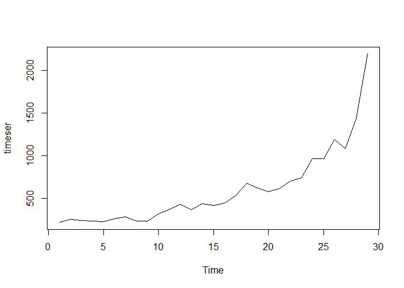

Smoothing the series - Moving Average Smoothing
-----------------------------------------------

``` r
w <-1
smoothedseries <- filter(timeser, 
                         filter=rep(1/(2*w+1),(2*w+1)), 
                         method='convolution', sides=2)
```

width= window, method convolution is moving average, sides=2, is a two sided filter

Smoothing left end of the time series

``` r
diff <- smoothedseries[w+2] - smoothedseries[w+1]
for (i in seq(w,1,-1)) {
  smoothedseries[i] <- smoothedseries[i+1] - diff
}
```

Smoothing right end of the time series

``` r
n <- length(timeser)
diff <- smoothedseries[n-w] - smoothedseries[n-w-1]
for (i in seq(n-w+1, n)) {
  smoothedseries[i] <- smoothedseries[i-1] + diff
}
```

Plot the smoothed time series
-----------------------------

``` r
timevals_in <- indata$Months
plot(timeser)
lines(smoothedseries, col="blue", lwd=2)
```

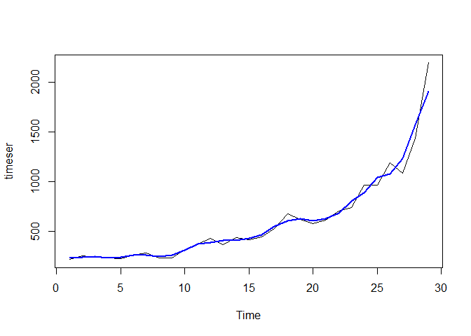

Model building
--------------

Building a model on the smoothed time series using classical decomposition

First convert the time series to a dataframe

``` r
smootheddf <- as.data.frame(cbind(timevals_in, as.vector(smoothedseries)))
colnames(smootheddf) <- c('Months', 'Price')
```

Fitting a multiplicative model with trend and seasonality to the data

Seasonality will be modeled using a sinusoid function

``` r
lmfit <- lm(Price ~ sin(0.5*Months) * poly(Months,3) + cos(0.5*Months) * poly(Months,3)
            + Months, data=smootheddf)
global_pred <- predict(lmfit, Month=timevals_in)
summary(global_pred)
```

    ##    Min. 1st Qu.  Median    Mean 3rd Qu.    Max. 
    ##   218.5   260.8   452.9   594.6   706.4  1918.4

``` r
plot(timeser)
lines(smoothedseries, col="blue", lwd=2)
lines(timevals_in, global_pred, col='red', lwd=2)
```

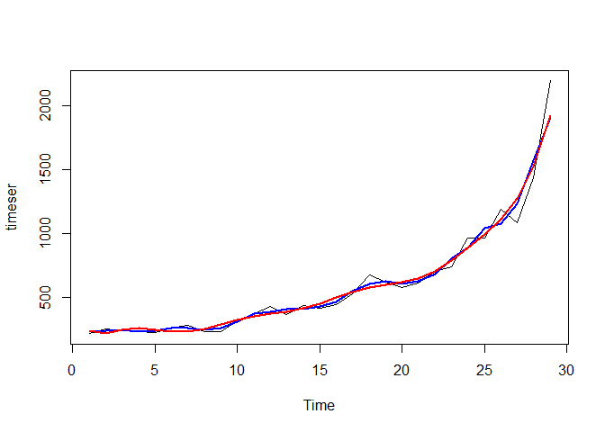

ARMA series
-----------

Extract locally predictable series and model it as an ARMA series

``` r
local_pred <- timeser-global_pred
plot(local_pred, col='red', type = "l")
```

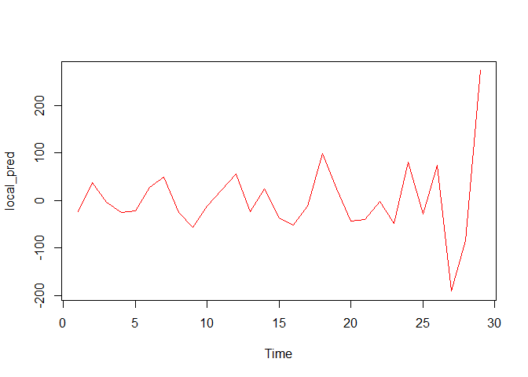

ACF plot

``` r
acf(local_pred)
```

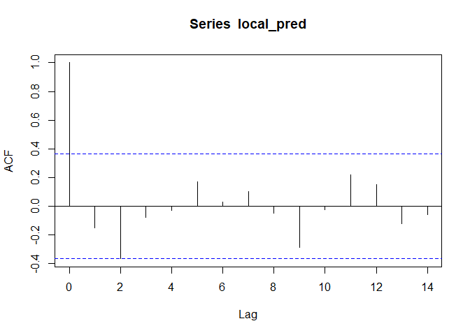

PACF plot

``` r
acf(local_pred, type="partial")
```

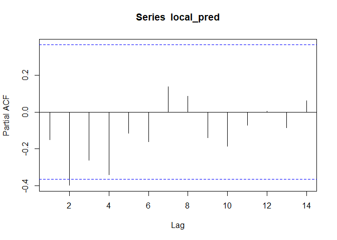

Armafit
-------

``` r
armafit <- auto.arima(local_pred)
```

Plot armafit

``` r
tsdiag(armafit)
```

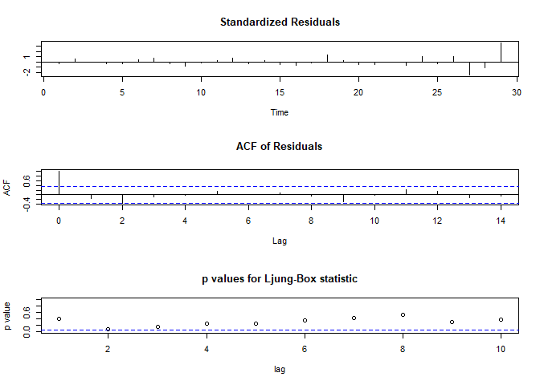

``` r
armafit
```

    ## Series: local_pred 
    ## ARIMA(0,0,0) with zero mean 
    ## 
    ## sigma^2 estimated as 5748:  log likelihood=-166.67
    ## AIC=335.34   AICc=335.49   BIC=336.71

Check if the residual series is white noise
-------------------------------------------

``` r
resi <- local_pred-fitted(armafit)
```

Augmented Dickey-Fuller Test

``` r
adf.test(resi,alternative = "stationary")
```

    ## Warning in adf.test(resi, alternative = "stationary"): p-value smaller than
    ## printed p-value

    ## 
    ##  Augmented Dickey-Fuller Test
    ## 
    ## data:  resi
    ## Dickey-Fuller = -5.4463, Lag order = 3, p-value = 0.01
    ## alternative hypothesis: stationary

KPSS Test for Level Stationarity

``` r
kpss.test(resi)
```

    ## Warning in kpss.test(resi): p-value greater than printed p-value

    ## 
    ##  KPSS Test for Level Stationarity
    ## 
    ## data:  resi
    ## KPSS Level = 0.062375, Truncation lag parameter = 2, p-value = 0.1

Model evaluation using MAPE
===========================

Make a prediction for the last 6 months

``` r
outdata <- rawdata[30:32,]
timevals_out <- outdata$Months

global_pred_out <- predict(lmfit,data.frame(Months =timevals_out))
```

    ## Warning in predict.lm(lmfit, data.frame(Months = timevals_out)): prediction
    ## from a rank-deficient fit may be misleading

``` r
fcast <- global_pred_out
```

Compare our prediction with the actual values, using MAPE

``` r
MAPE_class_dec <- accuracy(fcast,outdata[,2])[5]
MAPE_class_dec
```

    ## [1] 7.966572

Plot the predictions along with original values, to get a visual feel of the fit

``` r
class_dec_pred <- c(ts(global_pred),ts(global_pred_out))
plot(total_timeser, col = "black")
lines(class_dec_pred, col = "red")
```

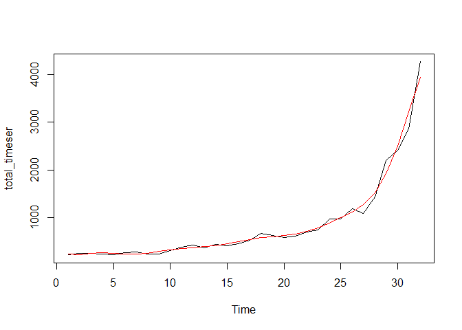

So, that was classical decomposition, now let's do an ARIMA fit

ARIMA fit
---------

Autoarima

``` r
autoarima <- auto.arima(timeser)
autoarima
```

    ## Series: timeser 
    ## ARIMA(0,2,1) 
    ## 
    ## Coefficients:
    ##           ma1
    ##       -0.5024
    ## s.e.   0.3208
    ## 
    ## sigma^2 estimated as 25669:  log likelihood=-175.01
    ## AIC=354.03   AICc=354.53   BIC=356.62

Plot autoarima

``` r
tsdiag(autoarima)
```

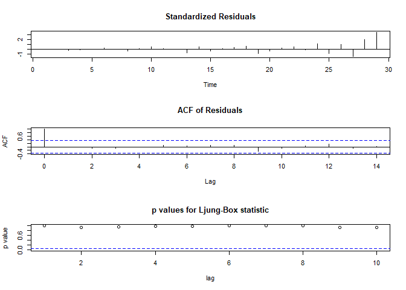

Plot autoarima fit

``` r
plot(autoarima$x, col="black")
lines(fitted(autoarima), col="red")
```

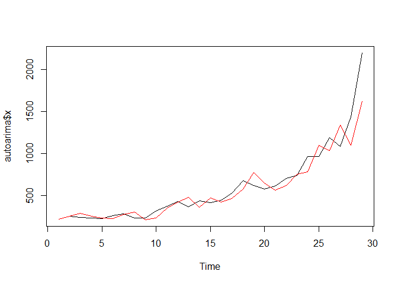

Check if the residual series is white noise

``` r
resi_auto_arima <- timeser - fitted(autoarima)
```

Augmented Dickey-Fuller Test

``` r
adf.test(resi_auto_arima,alternative = "stationary")
```

    ## 
    ##  Augmented Dickey-Fuller Test
    ## 
    ## data:  resi_auto_arima
    ## Dickey-Fuller = -2.5876, Lag order = 3, p-value = 0.3473
    ## alternative hypothesis: stationary

KPSS Test for Level Stationarity

``` r
kpss.test(resi_auto_arima)
```

    ## 
    ##  KPSS Test for Level Stationarity
    ## 
    ## data:  resi_auto_arima
    ## KPSS Level = 0.35371, Truncation lag parameter = 2, p-value =
    ## 0.09711

Model evaluation using MAPE
---------------------------

``` r
fcast_auto_arima <- predict(autoarima, n.ahead = 3)

MAPE_auto_arima <- accuracy(fcast_auto_arima$pred,outdata[,2])[5]
MAPE_auto_arima
```

    ## [1] 11.7434

Plot the predictions along with original values, to get a visual feel of the fit
--------------------------------------------------------------------------------

``` r
auto_arima_pred <- c(fitted(autoarima),ts(fcast_auto_arima$pred))
plot(total_timeser, col = "black")
lines(auto_arima_pred, col = "red")
lines(fcast_auto_arima$pred, col = "blue")
```

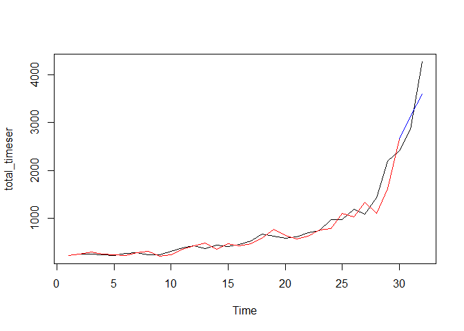
